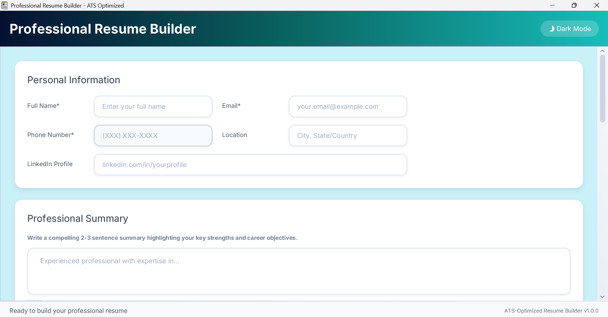
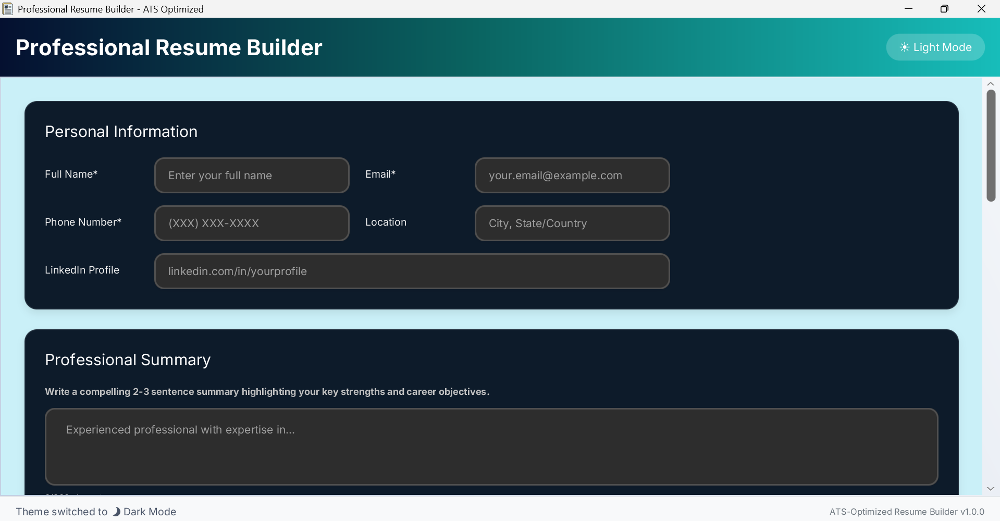
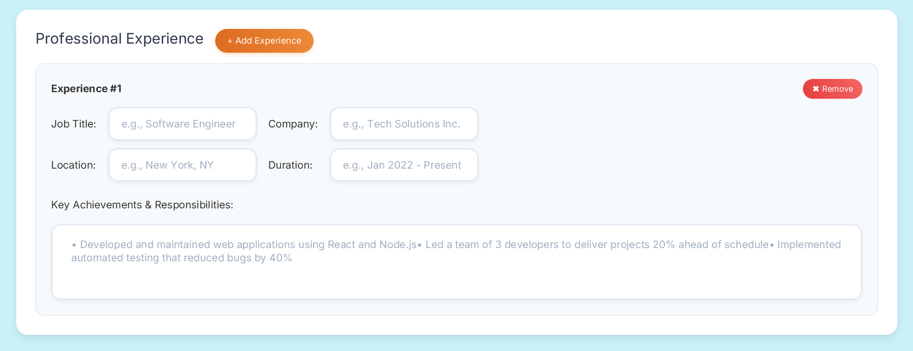
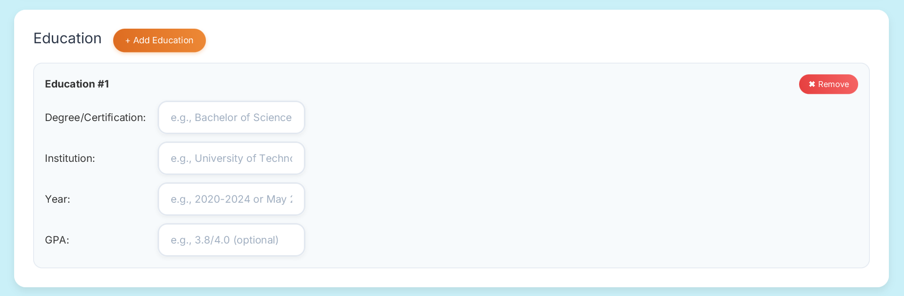
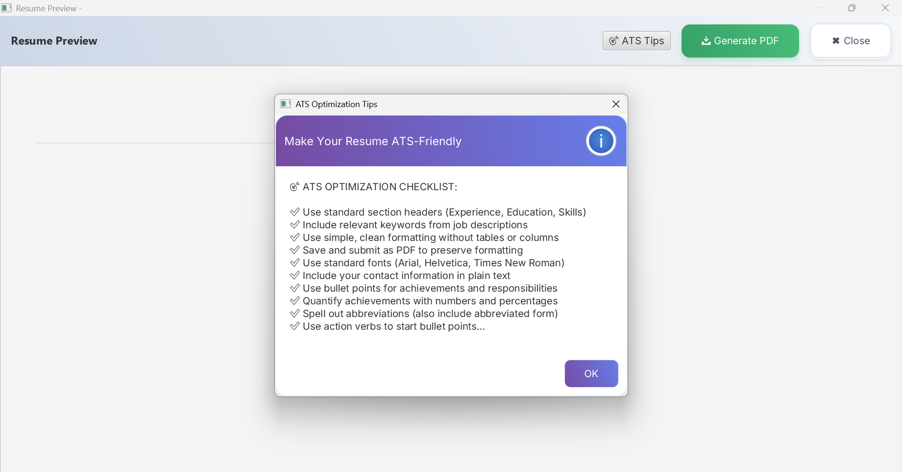

# Professional Resume Builder - ATS Optimized

A powerful desktop application built with JavaFX for creating ATS-optimized resumes with intelligent features, stunning UI design, and professional templates that help you land your dream job.

[](https://www.oracle.com/java/)
[](https://openjfx.io/)
[](https://maven.apache.org/)
[](https://github.com/AnkeshGG/ResumePortfolioBuilder/blob/master/LICENSE/LICENSE.txt)


## ✨ Why Choose This Resume Builder?

In today's competitive job market, your resume needs to pass through Applicant Tracking Systems (ATS) before it reaches human eyes. This application ensures your resume not only looks professional but also gets past these digital gatekeepers with ease.

## 🚀 Key Features

### 🎯 **ATS-Optimized Resume Creation**
- **Smart ATS Verification** - Build resumes specifically designed to pass Applicant Tracking Systems
- **Intelligent Formatting** - Ensures perfect readability by both ATS software and hiring managers  
- **Keyword Optimization** - Strategic content structuring for maximum ATS compatibility
- **Built-in ATS Tips** - Interactive guidance panel with expert recommendations

### 🎨 **Stunning User Interface**
- **Modern Gradient Design** - Beautiful teal-to-blue gradient interface that's a pleasure to use
- **Seamless Theme Switching** - Toggle between elegant Light and Dark modes instantly
- **Theme Persistence** - Application remembers your preferred theme and launches accordingly
- **Responsive Layout** - Fluid, intuitive interface that adapts to your workflow
- **Professional Typography** - Clean, readable fonts throughout the application

### 👀 **Real-Time Preview & Guidance**
- **Live Preview Window** - See exactly how your resume will look as you build it
- **Instant Updates** - Changes reflect immediately in the preview pane
- **ATS Optimization Checklist** - Built-in tips panel with comprehensive ATS guidelines
- **Interactive Editing** - Smooth, responsive form controls for effortless data entry

### 💾 **Advanced Export & Template System**
- **Professional PDF Generation** - Export high-quality, print-ready PDF resumes
- **Template Management** - Save your resume layouts as reusable JSON templates
- **Quick Template Loading** - Apply saved templates instantly to new resumes
- **Auto-save Functionality** - Never lose your work with intelligent background saving
- **Cross-Platform Compatibility** - Works seamlessly on Windows, macOS, and Linux

### ⚡ **Smart Features**
- **Dynamic Section Management** - Add/remove experience, education, and skill sections as needed
- **Intelligent Form Validation** - Ensures all required fields are completed
- **Professional Formatting** - Consistent, clean layout that impresses recruiters
- **Quantified Achievements** - Guidance for including metrics and percentages in your experience

## 📸 Application Screenshots

### Light Mode Interface


### Dark Mode Interface  


### Professional Experience Section


### Skills & Education Management


### Live Preview & ATS Tips


### Dark Mode Interface  
*Sleek dark theme for comfortable extended editing sessions*

### Professional Experience Section
*Dynamic experience entries with achievement-focused formatting*

### Skills & Education Management
*Organized sections for technical skills and educational background*

### Live Preview & ATS Tips
*Real-time preview window with integrated ATS optimization guidance*

## 🛠️ Technology Stack

- **Java 21** - Modern, robust programming language
- **JavaFX 21** - Rich desktop GUI framework for smooth user experience
- **Maven** - Efficient dependency management and build automation
- **OpenPDF** - Professional PDF generation with precise formatting
- **Gson** - Reliable JSON serialization for template management
- **JUnit 5** - Comprehensive unit testing framework

## 📋 System Requirements

### Prerequisites
- **Java Development Kit (JDK) 21** or higher
- **Maven 3.6** or higher  
- **Git** (for repository cloning)

### Verify Your Setup
```bash
# Check Java version (should be 21+)
java -version

# Check Maven version (should be 3.6+)
mvn -version

# Verify Git installation
git --version
```

## ⚡ Quick Start Guide

### 1. Clone the Repository
```bash
git clone https://github.com/AnkeshGG/ResumePortfolioBuilder.git
cd ResumePortfolioBuilder
```

### 2. Build the Application
```bash
# Clean and compile the project
mvn clean compile

# Run comprehensive tests
mvn test

# Create executable package
mvn package
```

### 3. Launch the Application

#### Method 1: Maven (Recommended)
```bash
mvn javafx:run
```

#### Method 2: Direct Java Execution
```bash
java -jar target/resumeportfolio-1.0.0-jar-with-dependencies.jar
```

#### Method 3: Windows Batch Script
```bash
# For Windows users
launcher.bat
```

## 📦 Building for Distribution

### Create Standalone Executable
```bash
# Generate fat JAR with all dependencies
mvn clean package

# Output: target/resumeportfolio-1.0.0-jar-with-dependencies.jar
```

### Windows Installer (Optional)
```bash
# Prerequisites: Install InnoSetup
# Compile: ResumePortfolioBuilder-Setup.iss
```

## 🏗️ Project Architecture

```
ResumePortfolioBuilder/
├── src/main/java/com/example/resumeportfolio/
│   ├── App.java                    # Application entry point
│   ├── Resume.java                 # Core resume data model
│   ├── ResumeGenerator.java        # PDF export functionality
│   ├── ThemeManager.java           # Light/Dark theme management
│   ├── ResumePreviewWindow.java    # Live preview implementation
│   └── ResumeTemplateManager.java  # Template save/load system
├── src/main/resources/
│   ├── styles/
│   │   ├── light-theme.css        # Light mode styling
│   │   └── dark-theme.css         # Dark mode styling
│   └── fxml/main.fxml             # JavaFX UI layout
├──src/test/java/com/example/resumeportfolio/
│   └── ResumeTest.java            # Core resume functionality tests
├── target/                        # Compiled output
├── pom.xml                        # Maven configuration
└── README.md                      # Project documentation
```

## 🎨 Customization Options

### Adding Custom Templates
1. Extend the base template class in `ResumeTemplateManager.java`
2. Define your custom layout and styling
3. Register the new template in the UI selection menu

### Theme Customization
1. Modify CSS files in `src/main/resources/styles/`
2. Update `ThemeManager.java` to register new themes
3. Add theme selection options to the interface

### Export Format Extensions
1. Extend `ResumeGenerator.java` for additional formats (Word, HTML)
2. Implement format-specific rendering logic
3. Add export options to the user interface

## 🧪 Testing & Quality Assurance

### Comprehensive Test Suite
The application includes a robust testing framework built with **JUnit 5** to ensure code reliability and maintainability.

#### Test Structure
```
src/test/java/com/example/resumeportfolio/
└── ResumeTest.java              # Core resume functionality tests
```

### Run Test Suite
```bash
# Execute all unit tests
mvn test

# Run tests with detailed output
mvn test -Dtest=ResumeTest

# Run integration tests
mvn verify

# Generate detailed test reports
mvn surefire-report:report
```

### Test Coverage & Reports
```bash
# Generate test coverage reports
mvn jacoco:report

# View coverage report
# Open: target/site/jacoco/index.html

# Generate comprehensive project reports
mvn site
```

### Testing Best Practices Implemented
- ✅ **Unit Testing** - Core `Resume` class functionality thoroughly tested
- ✅ **Test-Driven Development** - Tests guide feature implementation
- ✅ **Automated Testing** - Integration with Maven build lifecycle
- ✅ **Continuous Integration Ready** - Easy integration with CI/CD pipelines

## 🤝 Contributing

We welcome contributions! Here's how to get involved:

### Development Process
1. **Fork** the repository to your GitHub account
2. **Create** a feature branch: `git checkout -b feature/AmazingFeature`
3. **Implement** your changes with proper testing
4. **Commit** with descriptive messages: `git commit -m 'Add AmazingFeature'`
5. **Push** to your branch: `git push origin feature/AmazingFeature`
6. **Submit** a Pull Request with detailed description

### Contribution Guidelines
- Follow established Java coding conventions and best practices
- **Write unit tests** for all new functionality (see `ResumeTest.java` as reference)
- Update documentation to reflect any API or feature changes
- **Ensure all tests pass** before submitting PR: `mvn test`
- Use meaningful commit messages that explain the "why" not just "what"
- **Test Coverage** - Maintain or improve existing test coverage levels

## 📝 Version History

### Version 1.0.0 (Current Release)
- ✨ **ATS-Optimized Resume Building** - Complete ATS verification support with intelligent formatting
- 🎨 **Beautiful Dual-Theme Interface** - Stunning light/dark mode switching with preference persistence  
- 👀 **Real-Time Preview System** - Live preview window with instant updates as you edit
- 💡 **Integrated ATS Guidance** - Built-in tips panel with comprehensive optimization checklist
- 💾 **Advanced Template Management** - Professional PDF export with JSON template save/load functionality
- ⚡ **Smart Auto-Save** - Intelligent background saving with cross-platform compatibility

## 🐛 Known Issues & Limitations

- Some legacy ATS systems may require manual formatting adjustments for optimal parsing
- Extremely long text sections might need manual line breaks in PDF export
- Template switching with unsaved changes requires user confirmation (safety feature)

## 🔮 Roadmap & Future Enhancements

### Short-term Goals (Next Release)
- [ ] **Enhanced ATS Scoring** - Detailed compatibility analysis with improvement suggestions
- [ ] **Additional Professional Templates** - Industry-specific layouts for various career fields
- [ ] **Word Document Export** - Microsoft Word format support for broader compatibility

### Long-term Vision
- [ ] **AI-Powered Content Suggestions** - Intelligent recommendations based on job descriptions
- [ ] **LinkedIn Profile Integration** - Direct import from LinkedIn profiles
- [ ] **Job Board Keyword Analysis** - Real-time optimization for specific job postings
- [ ] **Resume Analytics Dashboard** - Performance tracking and improvement insights
- [ ] **Collaborative Review System** - Share and get feedback from mentors or peers

## 🔧 Troubleshooting Guide

### Common Issues & Solutions

**Problem**: Application fails to start
```bash
# Solution: Verify Java version compatibility
java -version
# Ensure you have Java 21 or higher installed
```

**Problem**: Build failures or dependency issues
```bash
# Solution: Clean rebuild with updated dependencies
mvn clean install -U
```

**Problem**: JavaFX modules not found
```bash
# Solution: Check JavaFX configuration in pom.xml
# Verify module-info.java settings
```

**Problem**: Theme switching doesn't work
```bash
# Solution: Check CSS file paths and ThemeManager configuration
# Ensure proper file permissions in resources directory
```

### Getting Help
- 📖 Check the [Wiki](https://github.com/AnkeshGG/ResumePortfolioBuilder/wiki) for detailed guides
- 🐛 Report bugs via [GitHub Issues](https://github.com/AnkeshGG/ResumePortfolioBuilder/issues)
- 💬 Join discussions in [GitHub Discussions](https://github.com/AnkeshGG/ResumePortfolioBuilder/discussions)


## 📦 Download

Visit the [Releases Page](https://github.com/AnkeshGG/ResumePortfolioBuilder/releases) to download the latest executable (JAR or installer).


## 📄 License

This project is licensed under the **MIT License** - see the [LICENSE](https://github.com/AnkeshGG/ResumePortfolioBuilder/blob/master/LICENSE/LICENSE.txt) file for complete details.

## 👨‍💻 About the Author

**Ankesh Kumar** - *Software Developer & Resume Optimization Enthusiast*

I'm passionate about creating tools that help professionals advance their careers. This resume builder was born from my own experience navigating the job market and understanding the critical importance of ATS optimization. With a background in software development and a keen eye for user experience design, I've crafted this application to bridge the gap between beautiful design and practical functionality.

### Connect With Me
- 🌐 **GitHub**: [@AnkeshGG](https://github.com/AnkeshGG)
- 💼 **LinkedIn**: [Ankesh Kumar](https://www.linkedin.com/in/ankesh-kumar-38363a287/)
- 📧 **Email**: [ankeshkumar.dev@gmail.com](mailto:ankeshkumar.dev@gmail.com)
- 🔗 **Medium**: [ankeshGG](https://medium.com/@ankeshGG)


## 🙏 Acknowledgments & Credits

### Technology Partners
- **[JavaFX Team](https://openjfx.io/)** - For providing an excellent framework for rich desktop applications
- **[OpenPDF Contributors](https://github.com/LibrePDF/OpenPDF)** - For robust PDF generation capabilities  
- **[Apache Maven](https://maven.apache.org/)** - For reliable build automation and dependency management
- **[InnoSetup](https://jrsoftware.org/isinfo.php)** - For professional Windows installer creation

### Inspiration & Research
- **ATS Industry Research** - Various HR technology blogs and ATS vendor documentation
- **UI/UX Design Principles** - Modern design system guidelines and accessibility standards
- **Resume Writing Experts** - Career coaching resources and professional resume guidelines

### Special Thanks
- **Beta Testers** - Early users who provided valuable feedback and bug reports
- **Open Source Community** - For continuous inspiration and collaborative spirit
- **Career Professionals** - Who shared insights about ATS requirements and hiring processes

## 📊 Project Status

🟢 **Actively Maintained** - This project is under active development with regular updates and feature additions.

### Current Development Focus
- Enhanced ATS compatibility testing
- Performance optimization for large resume datasets
- User experience improvements based on community feedback

### Contribution Statistics
- **Total Contributors**: 1 (growing!)
- **GitHub Stars**: ⭐ Star this repository to show your support!
- **Issues Resolved**: Tracking via GitHub Issues
- **Latest Release**: v1.0.0

---

### 🎯 Ready to Build Your Perfect Resume?

Don't let ATS systems filter out your talents. Create a resume that showcases your skills while passing every digital screening. 

**[⬇️ Download Now](https://github.com/AnkeshGG/ResumePortfolioBuilder/releases)** | **[📖 Quick Start Guide](#-quick-start-guide)** | **[🤝 Contribute](#-contributing)**

---

⭐ **If this project helped you land your dream job, please star this repository!** ⭐

*Your success story could inspire the next developer to build something amazing.*

